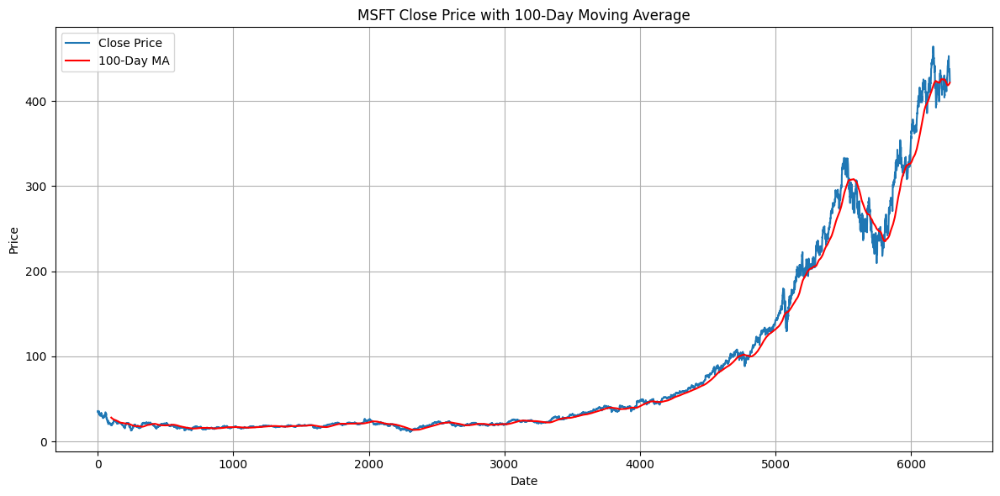
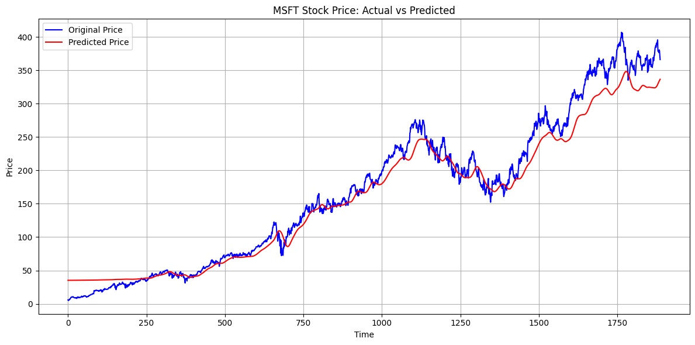

# 📈 Stock Trend Prediction App

[](https://www.python.org/)
[](https://streamlit.io/)
[](https://www.tensorflow.org/)
[](https://pypi.org/project/yfinance/)
<!--Deployment](https://img.shields.io/badge/Deployed-Streamlit-green?logo=streamlit)](https://your-deployment-url.com)  Replace with actual URL if applicable -->

---

## 📌 Overview

🔮 **Stock Trend Prediction App** is a Streamlit-powered web interface that utilizes a pre-trained LSTM model to forecast stock closing prices. It provides interactive data visualizations, moving average analysis, and future trend predictions based on historical time-series data fetched from Yahoo Finance via the `yfinance` API.

> 🧠 The model (`keras_model.h5`) was trained using a Long Short-Term Memory (LSTM) architecture on historical stock data. The training pipeline is not included in this repository.

🎯 Built for ML learners, finance enthusiasts, and academic or personal portfolio projects.

---

## ⚙️ Features

- 📊 **Interactive Visualizations**: Plot raw closing prices, 100-day and 200-day moving averages  
- 🧠 **LSTM Predictions**: Make predictions using a trained Long Short-Term Memory model  
- 🔄 **Data Pipeline**: Download, preprocess, scale, and inverse transform data on-the-fly  
- 🧮 **Real-Time Analysis**: View predictions and actual stock trends in real-time with visual overlays  
- 💡 **Educational Focus**: Designed for understanding deep learning in financial applications  

---


## 🛠️ Tech Stack

| Component            | Library / Tool      | |
|---------------------|---------------------|------|
| Web Interface        | Streamlit           |  |
| Deep Learning Model  | TensorFlow / Keras  |  |
| Financial Data       | yfinance            |  |
| Visualization        | matplotlib          |  |
| Data Processing      | pandas, NumPy       |   |
| Scaling              | scikit-learn        |  |


---

## 🗂️ Project Structure

```

stock-trend-prediction/
├── keras_model.h5          # Trained LSTM model
├── app.py                  # Streamlit application
├── README.md               # Project overview
├── requirements.txt        # Python dependencies
├── output_graphs/          # Prediction and training result visualizations
│   ├── 100 and 200.png
│   ├── 100.png
│   └── Predicted.png

````

---

## 🧭 Getting Started

To explore and experiment with stock trend forecasting using deep learning, clone this repo and follow the steps below.  
Make sure you have **Python 3.10+** installed.

---

## 🚀 How to Run

1. **Install the required packages**

   ```bash
   pip install -r requirements.txt


2. **Place the trained model**

   Ensure `keras_model.h5` (trained LSTM model) is present in the root directory.

3. **Run the application**

   ```bash
   streamlit run app.py
   ```

4. **Interact**

   Open your browser and go to `http://localhost:8501` to interact with the app.

---

## 📷 Output Visualizations

<div align="left">
   
   
  
  
</div>


---

## 🔒 Disclaimer & Limitations

### **⚠️ This application is intended strictly for educational and demonstrative purposes.**

The predictions made by this application are the result of a deep learning model trained on historical data and **should not be used to make actual investment or trading decisions**.

### ❗ Important Notes:

* This project **does not provide financial advice**.
* The developer and contributors **are not licensed financial advisors**.
* **No liability or responsibility** will be accepted for any financial loss or damage incurred due to reliance on the outputs of this app.

### ⚠️ Limitations:

* Model performance is limited by:

  * Quantity and quality of historical data
  * Latency or inaccuracies from third-party APIs (e.g., `yfinance`)
  * Lack of awareness of company fundamentals, breaking news, or macroeconomic indicators
  * Overfitting or underfitting during training
* It **does not account for**:

  * Intraday volatility
  * Real-time data streams
  * Sudden market shifts or geopolitical risks

### 📘 Use Responsibly:

This project is intended to showcase:

* Time series forecasting using LSTMs
* Deployment using Streamlit
* Real-world integration with APIs and visualizations

**It is NOT designed for live trading, algorithmic execution, or portfolio management. Any usage beyond educational or research purposes is strongly discouraged.**

---

## 🔐 Privacy & Security

If deployed publicly, this app:

* **Does not collect or store personal user data**
* **Processes ticker inputs locally**
* Relies on publicly accessible Yahoo Finance data via the `yfinance` API

> Always validate external API input sources and sanitize ticker symbols in production.

---

## 🤝 Contributing

Contributions are welcome!
Please open an issue to discuss changes or improvements before submitting a pull request.

If you'd like to add features, improve model performance, or extend visualizations — feel free to fork and build upon it.

---

## 🙋 Author

Developed by **@Avnish1447**
Connect on [LinkedIn](https://www.linkedin.com/in/avnish-agrawal-84b39728a/)
Explore more at [GitHub](https://github.com/Avnish1447)

---

✨ Happy Learning & Responsible Forecasting 📉📈
